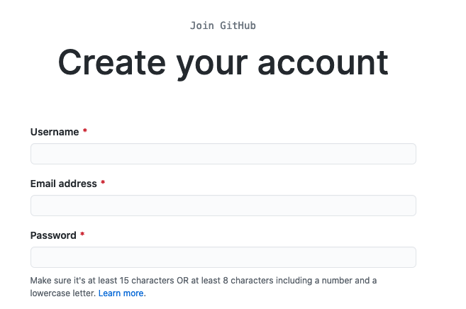

# Creating a git account

GitHub is a code hosting platform for version control and collaboration.
It is a good way for you to save our future C++ project that could be personal or collaborative.
An introduction to github could be found here:
https://guides.github.com/activities/hello-world/

You'll find below the basic instructions which are require to create an account on github.

  - Connect on https://github.com/
  - Click on "Sign up"
  - Create an account by entering a username, an email and a password as shown below
  
  - Confirm your registration from the email you will receive
  - Once you are connected, feel free to update our profile if you want
  - We will need to collect the list of username as we will use them for the evaluation

