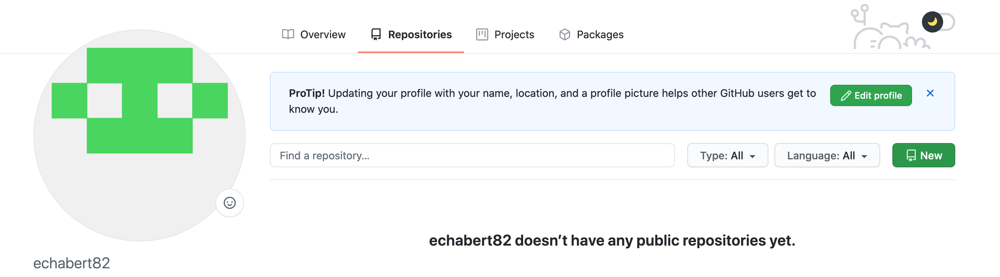
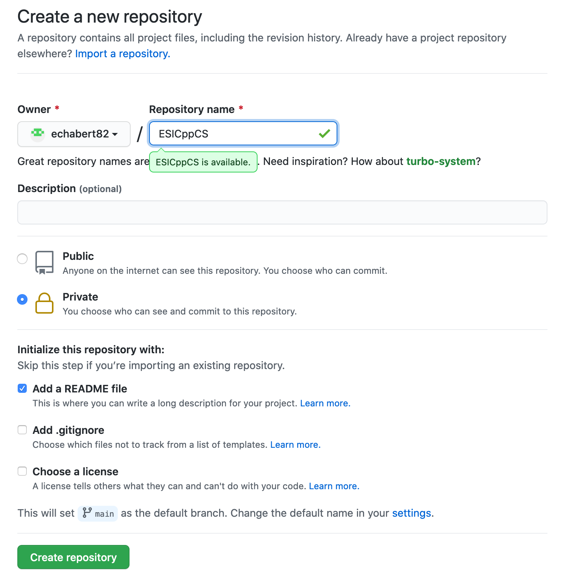
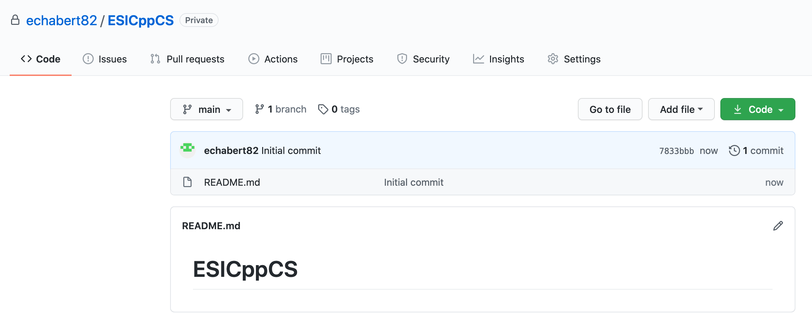
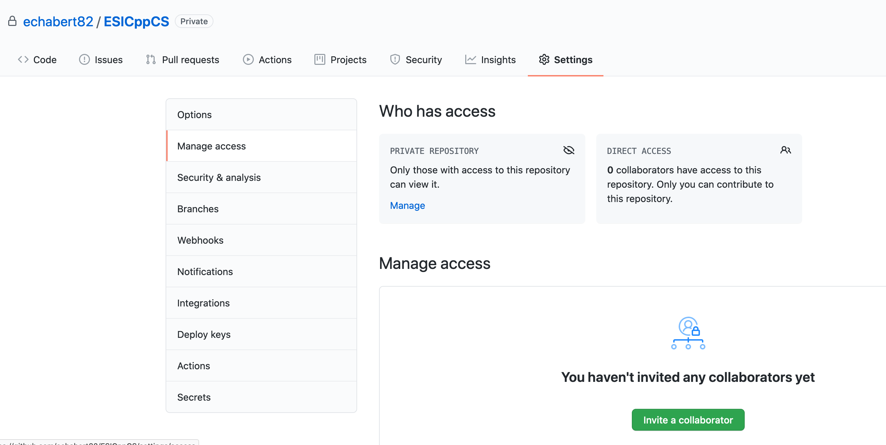
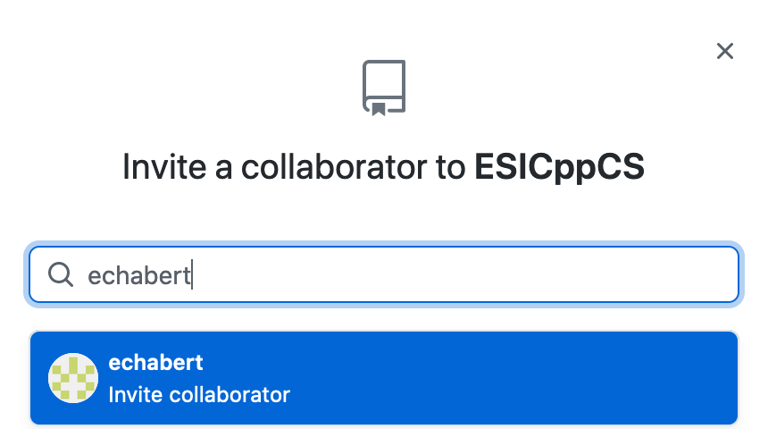

# Creating a private git repository

GitHub is a code hosting platform for version control and collaboration.
It is a good way for you to save our future C++ project that could be personal or collaborative.
An introduction to github could be found here:
https://guides.github.com/activities/hello-world/

For the computing session, we will ask you to create a repository.
To achieve this, please following the instructions described below

## 1 - New repository
You should have a page similar to the one below.

   - Click on **New** to create a new repository
   - Follow the screenshot below to create our repository
      - The name should be exactly the following on: **ESICppCS**
      - The repository should be **private** and not **public**
      - We ask you to add a file **README**

## 2 - Add the teachers as contributors
You should access to a page similar to the one below.

   - Click on **Setting** in the top menu and then **Manage access** on the left menu

   - Add collaborators by clicking on **Invite a new collaborator**. Add the two following username:
      - echabert
      - econte-cms

We will then receive an email and will be able to access to our repository.
This will be mandatory to evaluate our production.
