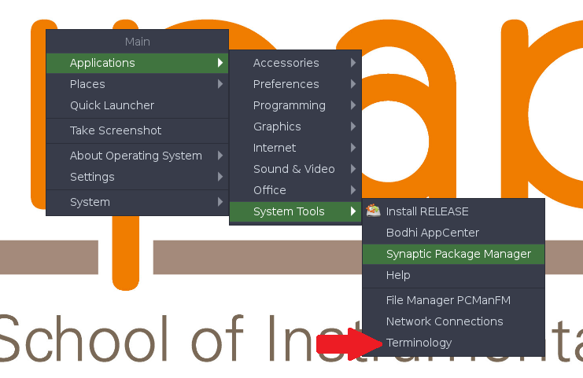

# Using the pre-configured Linux image

## Step 1: Installing the program VirtualBox

Developed by Oracle Corporation, VirtualBox allows yout to emulate an Windows, Linux or Macintosh environment on a machine working with Windows, Linux, Macintosh or Solaris. We advise that you should install the program from the binaries files. The last release VirtualBox is 6.1.32 and can be downloaded [here](https://www.virtualbox.org/wiki/Downloads). The file format will depend on your OS:
  - On Windows: a EXE installer program
  - On OSX: a DMG package
  - On Linux Distributions: a RPM package which depends on the Linux distributions that you have.

## Step 2 : Downloading the Linux image

We have prepared for you a pre-configured and compact Linux image based on the [Bodhi distribution](https://www.bodhilinux.com/) v5.1.0 (built on top of Ubuntu v18.04).

   - First, you need to download the image with the following [link](https://drive.google.com/file/d/1E1WTxtac5Pi1Oy6g8gaxnUnF5bRZP5CG/view?usp=sharing). The size of the OVA file is about 3.3 GB.
   - Then, you need to connect the image to VirtualBox. To do that, you have to click on the button "Import", or alternatively using the short-cut Ctrl+I. Then select the OVA file that you have just downloaded and click to import. Once unpacked, the image will occupy about 10 GB on your hard drive.
   
## Step 3 : Starting with the Linux image

   - Open VirtualBox.
   - Select the Linux image.
   - Click on Start.


## Step 4 : Some tricks to handle perfectly your Linux 

### Open a terminal

   - Do a left-click on the desktop window.
   - Select from the menu the program called Terminology 

### Accounts

   - Only one user: bodhi
   - Superuser account: `root` with the password: 123456
   

### Change the keyboard language

   - You need to edit hte configuration file `/etc/default/keyboard`:
   ```sudo nedit /etc/default/keyboard```
   - Change `XKBLAYOUT="us"` by `XKBLAYOUT="fr"` for the French keyboard. Other languages are also available. This is the list:
```
  us              USA
  ad              Andorra
  af              Afghanistan
  ara             Arabic
  al              Albania
  am              Armenia
  az              Azerbaijan
  by              Belarus
  be              Belgium
  bd              Bangladesh
  in              India
  ba              Bosnia and Herzegovina
  br              Brazil
  bg              Bulgaria
  ma              Morocco
  mm              Myanmar
  ca              Canada
  cd              Congo, Democratic Republic of the
  cn              China
  hr              Croatia
  cz              Czechia
  dk              Denmark
  nl              Netherlands
  bt              Bhutan
  ee              Estonia
  ir              Iran
  iq              Iraq
  fo              Faroe Islands
  fi              Finland
  fr              France
  gh              Ghana
  gn              Guinea
  ge              Georgia
  de              Germany
  gr              Greece
  hu              Hungary
  is              Iceland
  il              Israel
  it              Italy
  jp              Japan
  kg              Kyrgyzstan
  kh              Cambodia
  kz              Kazakhstan
  la              Laos
  latam           Latin American
  lt              Lithuania
  lv              Latvia
  mao             Maori
  me              Montenegro
  mk              Macedonia
  mt              Malta
  mn              Mongolia
  no              Norway
  pl              Poland
  pt              Portugal
  ro              Romania
  ru              Russia
  rs              Serbia
  si              Slovenia
  sk              Slovakia
  es              Spain
  se              Sweden
  ch              Switzerland
  sy              Syria
  tj              Tajikistan
  lk              Sri Lanka
  th              Thailand
  tr              Turkey
  tw              Taiwan
  ua              Ukraine
  gb              United Kingdom
  uz              Uzbekistan
  vn              Vietnam
  kr              Korea, Republic of
  nec_vndr/jp     Japan (PC-98xx Series)
  ie              Ireland
  pk              Pakistan
  mv              Maldives
  za              South Africa
  epo             Esperanto
  np              Nepal
  ng              Nigeria
  et              Ethiopia
  sn              Senegal
  brai            Braille
  tm              Turkmenistan
  ml              Mali
  tz              Tanzania
```  
   - Finally reboot the system.

### Create a shared disk

   - Start the Linux virtual machine.
   - On the top of the screen, select `Devices` -> `Settings` -> `Shared Folders...`
   - Choose the `Add` button and specify a folder on the host machine. Select also the `Make permanent` and `Automatical mount` options.
   - Open the `File Manager` from the icon in the task bar. Alternative: type at the prompt of a console: `pcmanfm`.
   - The shared folder should appear at the root of your folder tree.
   
