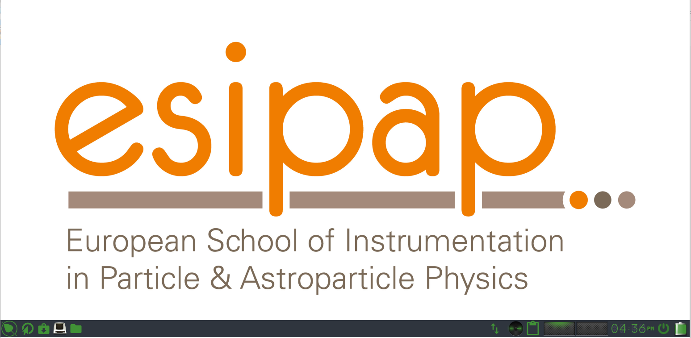

# Using the pre-configured Linux image

## Step 1: Installing the program VirtualBox

Developed by Oracle Corporation, VirtualBox allows yout to emulate an Windows, Linux or Macintosh environment on a machine working with Windows, Linux, Macintosh or Solaris. We advise that you should install the program from the binaries files. The last release VirtualBox is 6.1.16 and can be downloaded [here](https://www.virtualbox.org/wiki/Downloads). The file format will depend on your OS:
  - On Windows: a EXE installer program
  - On OSX: a DMG package
  - On Linux Distributions: a RPM package which depends on the Linux distributions that you have.

## Step 2 : Downloading the Linux image

We have prepared for you a pre-configured and compact Linux image based on the [Bodhi distribution](https://www.bodhilinux.com/) v5.1.0 (built on top of Ubuntu v18.04).

   - First, you need to download the image with the following [link](https://drive.google.com/file/d/1lFVl1nNlulRXMcI61fw0lp24aP-JmJr4/view?usp=sharing). The size of the OVA file is about 3.3 GB.
   - Then, you need to connect the image to VirtualBox. To do that, you have to click on the button "Import", or alternatively using the short-cut Ctrl+I. Then select the OVA file that you have just downloaded and click to import. Once unpacked, the image will occupy about 10 GB on your hard drive.
   
## Step 3 : Starting with the Linux image

   - Open VirtualBox.
   - Select the Linux image.
   - Click on the button "Start".
   - If everything works properly, you should reach the following desktop: 

## Step 4 : Some tricks to handle perfectly your Linux 

### Open a terminal

   - Click on the icon called "Terminology" in the bar tool. See the red arrow in the following screenshot. 

### Superuser account

   - Password: 123456

### Change the keyboard language

### Create a share disk

