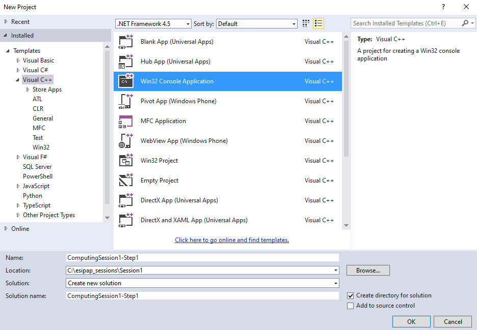
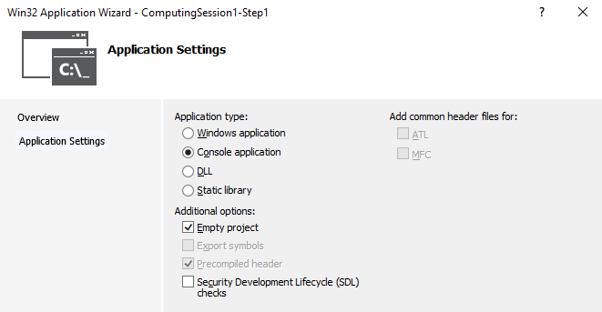
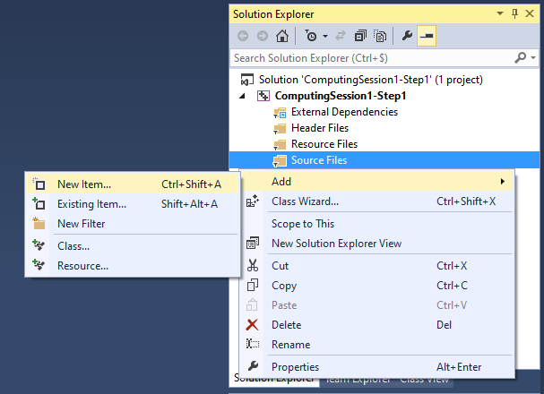
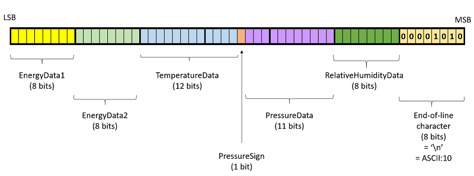

# Computing session 1: Introduction to development tools

This session should be done in 3 hours.
You are advised to refer the the C++ lectures and the links given below in order to
achieve the goals of this computing session.

## Goals
The subject of this first computing session is voluntarily simple in order to allow you to acquaint yourself with the environment and good practices of C++ development. During this session, you must write in C++ a program from scratch and step-by-step. The program to design and to code must be able to read data, acquired by a sensor device and encoded in a binary file, to decode them and to save them into a CSV which can be read by a spreadsheet like Excel or OpenCalc.

## Skills to develop
  - Becoming familiar with C++ development environment (compiler, linker, text editor, ...).
  - Writing a simple C++ program.
  - Manipulating bits in order to decipher data.
  - Using the STL classes for reading/writing a file and for displaying informations at the screen.
  - Structuring the program in functions and in different source files.
  - Saving and sharing the C++ code with a version-control system (Git in our cases).

## Tools used
   - **Compiler**: 
       - on Linux/MacOSX machines, the default compiler is **g++**. Alternatively, **clang** can also be used.
	   - on Windows machines, we use Visual Studio 2013 compiler, named **cl**.
   - **Text editor**: feel free to use the editor of our choice:
       - on the Linux virtual machine, several editors are available including emacs, gedit, nedit, vi/vim, ...
	   - on Windows machines, the Visual Studio IDE (Integrated Development Environment) is recommended or a smart text editor such as [NotePad++](https://notepad-plus-plus.org/downloads/).   
   - **Git**: requires to have an accound on [github](https://github.com/)

## Instructions

In order to ease the realization of this computing session, it has been decomposed into short steps.
At the end of each of them, you can compile and test our program before going further.

### Step 0: Preparing your work environment

#### Step 0.1: Downloading the instructions 

You must access to the last version of our instructions order to do the computing sessions. Please follow the instructions in order to have the updated code.

   - Opening a new console session:
      - On Linux/macOSX machines, you must click on the icon of the Terminal.
	  - On Windows machines, you must open the program "VS2013 x86 Native Tools Command Prompt" (not the x64!).

   - Creating a working folder:<br/>

      - On Linux/macOSX machines, you must issue the following commands:<br/>
        ```
        cd 
        mkdir esipap_instructions
	    cd esipap_instructions
		```
        
      - On Windows machines, you must issue the following commands:<br/>
        ```
        cd C:\
        mkdir esipap_instructions
	    cd C:\esipap_instructions
        ```
   - Download our main github repository by typing the command:
     ```
     git clone https://github.com/echabert/ESIPAPCpp.git
     ```
     Comment: This last step can also be carried out by downloading a zip archive of the code (needed to be unzip)
   https://github.com/echabert/ESIPAPCpp/archive/main.zip

#### Step 0.2: Creating your own repository

  - The goal of this section is to create a remote repository where you can save your results. You need to follow the instructions described in [the section Git Repository](../doc/git/GitRepository.md).

   - Opening a new console session:
     - On Linux/macOSX machines, you must click on the icon of the Terminal.
	 - On Windows machines, you must open the program "VS2013 x86 Native Tools Command Prompt" (not the x64!).

   -  Once the repository is created, you can *download it* (*clone* it). To do that, first, opening a new console session:<br/>
   
      - On Linux/macOSX machines, you must issue the following commands:<br/>
        ```
        cd 
        mkdir esipap_sessions
	    cd esipap_sessions
        ```
      - On Windows machines, you must issue the following commands:<br/>	   
         ```
         cd C:\
         mkdir esipap_sessions
	     cd C:\esipap_sessions
         ```
   - Downloading your github repository by typing the command:
     ```
       git clone https://github.com/your_username/ESICppCS.git
     ```
     where your\_username as to be replaced by your username.
     A password will be asked.

#### Step 0.3: Creating your working folder for Computing Session 1

  - In a console session, entering the folder ```ESICppCS``` by issuing the command lines:
	   - On Linux/MacOSX machines: ```cd ~/esipap_sessions/ESICppCS```
	   - On Windows machines: ```cd C:\esipap_sessions\ESICppCS```
	   
  - Creating a folder devoted to Computing Session 1 code: 
	```
	   mkdir Session1
	   cd Session1
	```
	
  - In the folder ```Session1```, creating a new text file called ```readme.txt``` containing the sentence ```Folder corresponding to ESIPAP-2021 Computing Session 1```
	
  - Telling Git that you have added a new file by issue the command line in the console:
      ```git add readme.txt```
	  
  - Recording the changes to the local repository with the following command:
	  ```git commit -m 'add readme.txt file` readme.txt```
	  
  - Propagating the changes to the remote repository with the following command:
	  ```git push```


### Step 1: Creating, building and running a 'Hello World!' program

   - In the folder `Session1` folder, creating a source file called `helloworld.cpp` with the following content:
     ```
       #include<iostream>
       using namespace std;

       int main()
       {
	     // Core program
	     cout << "Hello World!" << endl;
	
	     // Wait that user pushes a button (relevant for Windows system)
	     cout << "Push a button to quit" << endl;
	     cin.get();
		 
		 // Return no error code
	     return 0;
       }	   
	 ```
	 
   - The way to build this program depends on your machine:
       - On Linux/MacOSX machines, the building (compilation + link + creation of an executable file called `helloworld`) can be done by typing the command `
	     ```
		   g++ -o helloword helloworld.cpp
		 ```
	   - On Windows machines by using command lines, the building (compilation + link + creation of an executable file called `helloworld.exe`) can be done by typing the command `
	     ```
		   cl helloworld.cpp /link /out:helloworld.exe
		 ```
	   - On Windows machines by using the Visual Studio interface, the building (compilation + link + creation of an executable file called `helloworld.exe`) can be done by following the different steps:
    	  - Creating a new *project* or *solution* and selecting a Win32 console program such as below:<br/>
		      
    	  - Selecting that you would like an empty solution as below<br/>
		      
		  - In the windows *Solution explorer*, making a right click on `Sources files`, then `Add`, `Create a new item` and finally `a cpp file`.<br/>
		      
          - Building the program by clicking on the button "Local Windows Debugger"	or using the shortcut CTRL+F5.	  
		  

   - Executing the program:
       - On Linux/MacOSX machines: ```./helloworld```
	   - On Windows machines by using command lines: ```helloworld```
	   - On Windows machines by using the Visual Studio interface: click on the button "Local Windows Debugger"
	  
   - Saving the code in the remote repository:
	
	  - Telling Git that you have added a new file by issue the command line in the console:
      ```git add helloworld.cpp```
	  
      - Recording the changes to the local repository with the following command:
	  ```git commit -m 'add helloworld program' helloworld.cpp```
	  
      - Propagating the changes to the remote repository with the following command:
	  ```git push```
	  
### Step 2: Decoding a binary file by using STL classes

The goal of this section is to design a program which allows you to open a file, decode a binary content and display the content at the screen.

**Specifications of the program:** only one source file called `DataReader.cpp`

  - The code must open the binary file `sensor.dat` and check that the file is properly opened. This file can be found in:
    - on Linux/MacOSX machines: `~/esipap_instructions/sessions/session1/sensor.dat`
	- on Windows machines: `C:\esipap_instructions\sessions\session1\sensor.dat`
	  
  - The code must extract and store in memory the 7-byte data from the file. 
     	  
  - The code must decode the data. In order to achieve this task, the developer needs to know the data structure used to encode the content. It is given by the figure below. One acquisition corresponds to 7 bytes *i.e* 56 bits.<br/>
       
    Data `EnergyData1` and `EnergyData2` are not enciphered. The decoding relation for the other data are given by the formula below.<br/>
       
	   
  - Finally, the code must display at the screen the decoded values.
	
**Instructions:**

  - Writing the `DataReader.cpp` file.
  - Building the program and creating an executable file.
  - Launching the program and check that you obtain the following output.
  	```
	   Byte1=127  Byte2=255  Byte3=170  Byte4=40  Byte5=22  Byte6=140  Byte7=10
	```
	```
	   E1=127  E2=255  T=44.9963[°C]  P=109972[Pa]  RH=54.902[%]
	```
  - Saving your code by using properly the commands `git add`, `git commit` and `git push`.
  
**Piece of advice:**
  - You have to handle binary values and operations in C++. A small appendix in PDF can be read for this purpose: [Handling binary and bit values](session1/bits_appendix.pdf).
  - Put some comments in your code in order to explain what you are doing.
  - For displaying properly a the screen the unit `°C`, you can type `cout << "\370" << "C";`

### Step 3: Decoding a binary file with multiple data

The previous file `sensor.dat` contents only one sensor acquisition. Now, we would like to extend the previous program to the reading of a 100-acquisition binary file. This file can be found here:
  - on Linux/MacOSX machines: `~/esipap_instructions/sessions/session1/sensor2.dat`
  - on Windows machines: `C:\esipap_instructions\sessions/session1\sensor2.dat`

The goal of this section is to design a program which allows you to open a file, decode a binary content and display the content at the screen.

**Specifications of the program:** only one source file called `DataReader.cpp`
  - The code must extract the data from the 100-acquisition file `sensor2.dat`.
  - The code must display them at the screen (one line an acquisition).
  
**Instructions:**
  - Adapting the `DataReader.cpp` file.
  - Building the program and creating an executable file.
  - Saving your code by using properly the commands `git commit` and `git push`.  
  
### Step 4: Converting the binary file to a human-readable format

The goal of this section is to produce a CSV file (Comma Separated Value) from the numerical values corresponding to the data. The produced CSV output file could later be tested by other program/applications such as `OpenOffice`or `Excel`.

**Specifications of the program:** only one source file called `DataReader.cpp`
   - The code must extract the data from the 100-acquisition file `sensor2.dat`.
   - The code must display them at the screen (one line an acquisition).
   - The code must open a new file in writing mode called `sensor2.csv` and write the data in a structured way: values separated by a comma, one line per entry into the CSV file.

**Instructions:**
  - Adapting the `DataReader.cpp` file.
  - Building the program and creating an executable file.
  - Running the executable file and checking the production of the file `sensor2.csv`.
  - Comparing the size of the binary file and the CSV file. How can you intepret the difference?
  - Opening the CSV file with a spreadsheet such as `Excel` or `OpenOffice` and producing one graphic with the temperature data for instance.
  - Saving your code by using properly the commands `git commit` and `git push`. 

**Piece of advice:**
  - You have to use several classes from the Standard Template Library (STL), in particular:
    - [ofstream](http://www.cplusplus.com/reference/fstream/ofstream/) : a class which allow to write file
  
### Step 5: Using functions in your codes

The goal of this section is to move the block of instructions that handle the binary decoding into a well-defined function in order to be reused in other applications if needed.
In order to do this, you need to:

**Specifications of the program:** only one source file called `DataReader.cpp`
   - Defining properly the prototype of the function callled *Decoding* (return type and ordered list of arguments with there type). You have the freedom to design the prototype as you which.
   - Implementing the function *Decoding*.
   - Calling the function in the *main*.

**Instructions:**
  - Adapting the `DataReader.cpp` file.
  - Building the program and creating an executable file.
  - Testing the program.
  - Saving your code by using properly the commands `git commit` and `git push`.  

### Step 6: File splitting

The goal of this section is to split the program into 3 files:
  - An header file containing the prototype of the function: *Decode.h*
  - A source file containing the definition of the function: *Decode.cpp*
  - A main file containing the function main: *main.cpp*

**Instructions:**
  - Adapting the `DataReader.cpp` file.
  - Building the program and creating an executable file.
  - Testing the program.
  - Saving your code by using properly the commands `git add`, `git commit` and `git push`.  
  
**Piece of advice:**
   - The header files need to be protected against multiple inclusion.
   - The compilation can be done in several step as there is 2 cpp files.

### Optional Step: going further

This last step is **not mandatory**. 
If you have already finished the previous steps and want to go further, we provide you several options:
   - Use arguments of the *main* function to pass the name of the input file into the command line.
   - Compute basic statistics (mean and std-deviation) for each of the main variables and report them at the end of the execution.
