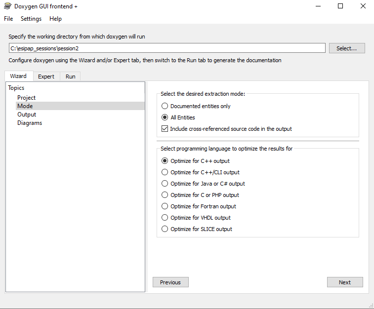

# Computing session 2: Class development

This session should be done in 3 hours.
You are advised to refer the the C++ lectures and the links given below in order to
achieve the goals of this computing session.

## Goals
The goal of this computing session is to write step-by-step a complete and operational C++
class. The class content is described by a UML (Unified Modeling Language) diagram. The
class implementation must be tested in a main program.

## Skills to develop
  - Implementing new classes from UML diagrams.
  - Instantiating objects from classes and initializing them.
  - Improving the robutness of the code in order to prevent abnormal termination or unexpected actions.
  - Respecting a given set of programming rules and conventions.
  - Generating automatically the reference documentation related to the code with Doxygen.

## Tools used
   - **Compiler**: 
       - on Linux/MacOSX machines, the default compiler is **g++**. Alternatively, **clang** can also be used.
	   - on Windows machines, we use Visual Studio 2013 compiler, named **cl**.
   - **Text editor**: feel free to use the editor of our choice:
       - on the Linux virtual machine, several editors are available including emacs, gedit, nedit, vi/vim, ...
	   - on Windows machines, the Visual Studio IDE (Integrated Development Environment) is recommended or a smart text editor such as [NotePad++](https://notepad-plus-plus.org/downloads/).   
   - **Git**: requires to have an accound on [github](https://github.com/)
   - **Doxygen**: this tool must be *a priori* installed on your machine.

## Instructions

In order to ease the realization of this computing session, it has been decomposed into short steps.

### Step 0: Preparing your work environment

#### Step 0.1: Updating the instructions 

You must access to the last version of our instructions order to do the computing sessions. Please follow the instructions in order to have the updated code.

   - Opening a new console session:
     - On Linux/macOSX machines, you must click on the icon of the Terminal.
	 - On Windows machines, you must open the program "VS2013 x86 Native Tools Command Prompt" (not the x64!).

   - Entering the working folder
     - On Linux/macOSX machines, you must issue the following commands:
       ```
          cd ~/esipap_instructions
       ```
     - On Windows machines, you must issue the following commands:	   
        ```
		  cd C:\esipap_instructions
        ```
   - Update our repository by typing the command:
   ```
      git pull
   ```

#### Step 0.2: Creating your working folder for Computing Session 2

  - In a console session, entering the folder ```ESICppCS``` by issuing the command lines:
	   - On Linux/MacOSX machines: ```cd ~/esipap_sessions/ESICppCS```
	   - On Windows machines: ```cd C:\esipap_sessions\ESICppCS```
	   
  - Creating a folder devoted to Computing Session 2 code: 
	```
	   mkdir Session2
	   cd Session2
	```
	
  - In the folder ```Session2```, creating a new text file called ```readme.txt``` containing the sentence ```Folder corresponding to ESIPAP-2021 Computing Session 2```
	
  - Telling Git that you have added a new file by issue the command line in the console:
      ```git add readme.txt```
	  
  - Recording the changes to the local repository with the following command:
	  ```git commit -m 'add readme.txt file` readme.txt```
	  
  - Propagating the changes to the remote repository with the following command:
	  ```git push```


### Step 1: Choosing a class to develop

In the context of a project, two classes must be implemented: *StatisticsCalculator* and *PsychrometricCalculator*. We will share the work by making two teams: one team will develop the class *StatisticsCalculator* and the other will develop the class *PsychrometricCalculator*. This is a small summary of the goal of each class:
  - The class *StatisticsCalculator* must deal with a set of data and offer useful relevant statistical functions which can provide the average, the mediane, the standard deviation, ... Trough this implementation, the developer will pratice the manipulation of arrays.
  - The class *PsychrometricCalculator* must compute the thermics properties of the humid air from the temperature and relative humidity inputs. Through this implementation, the developer will pratice the coding of mathematical formulas.

Please choose one of this class to implement and specify your choice on this [form](https://docs.google.com/forms/d/e/1FAIpQLSeqoWcfVSY4aO8FlfHdYBqJdOmztgNeQJa1ihJvOu0r5eUAzQ/viewform?usp=sf_link)

### Step 2: Implementing the class chosen

Implement the class chosen by considering the specifications which are here:
  - specifications for [StatisticsCalculator](statistics_calculator.md)
  - specifications for [PsychrometricCalculator](psychrometric_calculator.md)
 
**Piece of advice:**
  - The class implementation must be split in a header file `.h` and in a source file `.cpp`. You must be careful about what you put in the header file and what you put in the source file.
  - You must test your class implementation by creating a main source file `main.cpp` which uses the implemented class.
  - Do not code the whole class before testing it. Code the class step-by-step and at each step test the implementation.
	  
### Step 3: Producing the automatical documentation of your code with Doxygen

Annotation and comments inside the code is very useful for the understanding. In order to increase the documentation level, it is also possible to generate automatically reference documentation by reading the syntax and the annotations of the code. Whereas some documentation generators such as *Javadoc* are specific to one programming language, the *Doxygen* program has the advantage to be used for plenty languages.

#### Step 3.1: Running Doxygen on Linux/MacOSX

  - Doxygen must be callable from any place. Open a new console session and check with the command below that Doxygen is properly installed: <br/>
  ```doxygen --version```  

  - The starting point consists in writing a doxygen configuration file. A template of a such file can be generated by typing the following command:<br/>
  ``` doxygen -g doxygen.cfg```
  
  - A text file called `doxygen.cfg` is then created and can be modified with a text editor. It contains all the available Doxygen options set with the default values. The syntax is very similar to a shell script. To enter into details, comment line begins with a # character and options are
specified by the scheme tag = value. The options values are usually the reserved words *YES* or *NO* for binary options, or string for other option kinds. Appearance order of the options is not relevant.<br/>

  For getting a minimum of details, you must set the following settings:<br/>
```
PROJECT_NAME = Computing session 2 # Name fo your project
FULL_PATH_NAMES = YES
JAVADOC_AUTOBRIEF = YES
HIDE_UNDOC_CLASSES = NO
GENERATE_LATEX = NO
TAB_SIZE = 4
OPTIMIZE_OUTPUT_FOR_C = YES
BUILTIN_STL_SUPPORT = YES
EXTRACT_ALL = YES
EXTRACT_PRIVATE = YES
EXTRACT_PRIV_VIRTUAL = YES
EXTRACT_PACKAGE = YES
EXTRACT_STATIC = YES
RECURSIVE = YES
SOURCE_BROWSER = YES
ALPHABETICAL_INDEX = YES
GENERATE_TREEVIEW = YES
TEMPLATE_RELATIONS = YES
SEARCHENGINE = YES
REFERENCED_BY_RELATION = YES
```

  For generating HTML pages, you must set the following settings:<br/>
```
GENERATE_HTML = YES
HTML_OUTPUT = html  # put here the name of the folder where you would like to store the HTML pages
```

  For generating the LaTex pages, you must set the following settings:<br/>
```
GENERATE_LATEX = YES
HTML_OUTPUT = latex  # put here the name of the folder where you would like to store the LaTex pages
```

  For enabling all the graphical options in the report, you must apply the following settings:<br/>
```
HAVE_DOT = YES
CLASS_GRAPH = YES
COLLABORATION_GRAPH = YES
GROUP_GRAPHS = YES
UML_LOOK = NO
TEMPLATE_RELATIONS = YES
INCLUDE_GRAPH = YES
INCLUDED_BY_GRAPH = YES
CALL_GRAPH = YES
CALLER_GRAPH = YES
GRAPHICAL_HIERARCHY = YES
DIRECTORY_GRAPH = YES
DOT_MULTI_TARGETS = YES
```

  - To generate automatically documentation, the user has just to type the Doxygen command following by the name of the configuration file:<br/>
```
doxygen doxygen.cfg
```

#### Step 3.1: Running Doxygen on Windows

On Windows machines, the previous instructions (devoted to Linux) can be used. You need first to put the folder `C:\Program Files\doxygen\bin` in the *PATH* environment variable.<br/>

Alternatively, the user can use the program *Doxywizard*. The following instructions explain you how to use it:
  - In the main box, specifiy the *working directory from which doxygen will run*, the *project name*, the *source cord directory* and the *destination directory*. Check also the box called *Scan recursively*.<br/>
    
  - In the tab *Wizard*, click on the topic *Mode*. Then select *all entities* and check the box *Include cross-referenced source code in the output*.<br/>
    
  - In the tab *Expert*, click on the topic *Build*. Then check these boxes: *EXTRACT_ALL*, *EXTRACT_PRIVATE*, *EXTRACT_PRIV_VIRTUAL*, *EXTRACT_PACKAGE*, *EXTRACT_STATIC*. <br/>
      
  - In the tab *Run*, click on *Run doxygen*.
  
#### Step 3.2: Opening the HTML documentation

If the running is successful, folders *html* and *latex* are generated according to the configuration file:
  - *html* folder contains all HTML files and can be browsed with a internet browser from the file *index.html*.
  - *latex* folder contains latex files and can be compiled with latex with a makefile. By issiung the command make, a PDF file is created and can be viewed with a PDF reader.

Open the file *index.html* in the folder *html* with an internet browser and check the content. Add/adjust annotations in your code in order to improve
the generated documentation.

### Step 4: Saving and sharing your code

Save your code and the Doxygen documentation by using properly the commands `git add`, `git commit` and `git push`.  
