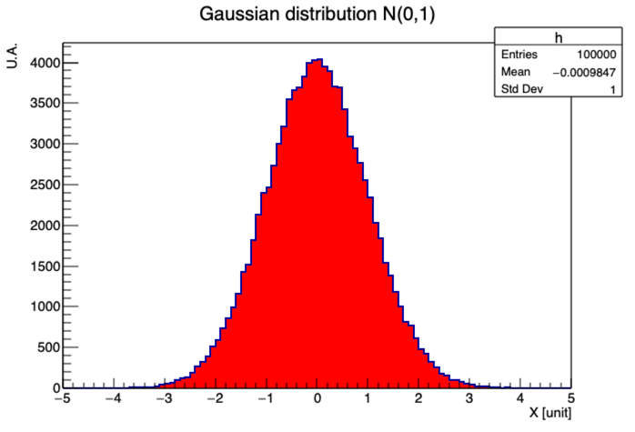
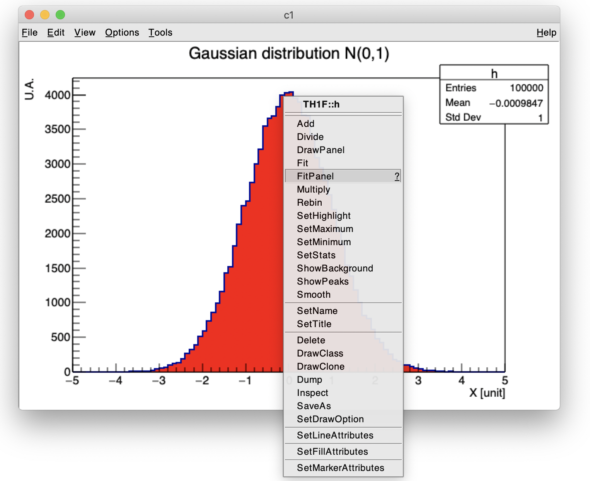
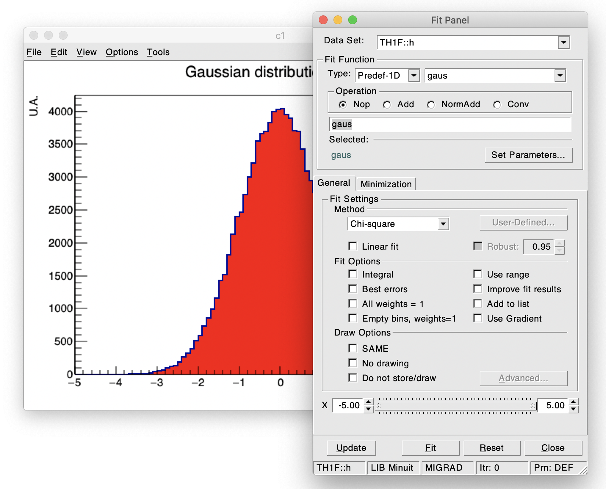

# Session 4
#   ROOT

This session should be done in 3 hours.
We will start by a demonstration given by one of the teachers.


The framework ROOT contains many C++ libraries related data storage, data analysis, visualization, fitting, mathetatics and statistics, randomization and Monte-Carlo, event display, GUI, etc

It is impossible to cover each of those domains in 3 hours, even briefly.
Thus, we will  focus on the most useful and popular functionalities and will learn several ways to access them: in a interactive mode or as external libraries linked to your project.


## Goals:
  - Becoming familiar with ROOT environment
  - Knowing the basics to use ROOT interpreter
  - Discovering the most popular functionnalities: histogramming, file saving, fitting
  - Knowing how to use ROOT libraries in a standalone C++ compiled project


## Context:
The aim of this session was to write a program reading a binary file saved by a certain device, decode its content and save its data into a csv file.
During this session will do a basic data analysis of those data using ROOT.


## Links:
You will found below useful links about the ROOT software which will be useful for this session:
   - [Website](https://root.cern.ch/)
   - [ROOT manual](https://root.cern/manual/)
   - [Reference’s guide](https://root.cern/doc/master/)
   - [Tutorials](https://root.cern/doc/master/group__Tutorials.html)


## Steps

In order to ease the realization of this computing session, it has been decomposed into short steps.

### Step 1 - ROOT Interpret and basic histogramming

As an introduction, in that step, we will use **CINT**, the ROOT interpreter.
To access it, you need to launch the application. In macOS/Linux, you can simply type **root** in our terminal. In Windows, you can launch the application.

#### First plot: FirstHisto.cpp

Create a file **FirstHisto.cpp** containing a function **void FirstHisto()**.
After having tested the basic instructions in the interactive session, write C++ commands in the avoved-mentioned function to fullfill what is mentioned below.
Create an histogram with 100 bins and a range of [-5,5] filled with 100000 random numbers following a Gaussian distribution of parameters (mu=0,sigma=1) using the method **FillRandom**.
   - Change the title axes: "X [unit]" and "A.U."
   - Change the histogram line width (2) 
   - Change the histogram to be filled in red
   - Change the title: "Gaussian distribution N(0,1)"
The results should be the following one.


**Save the file in our git repository**

#### Data visualization: Csv2Plot.cpp

The goal is to write a new file **Csv2Plot.cpp** containing an eponym function which will read the CSV file produced during the first session (the file can also be retrieved [HERE](session4/sensor2.csv)) and produce basic one-dimensional histograms.
   - Read the CSV file
   - Display each variable into a dedicated [TH1F](https://root.cern.ch/doc/master/classTH1F.html) (using the method **Fill**)
   - Choose different color line for each histogram
   - Overlay the histograms related to XX in a [TCanvas](https://root.cern.ch/doc/master/classTCanvas.html)
   - Add a legend using the class [TLegend](https://root.cern.ch/doc/master/classTLegend.html)
   - Save the resulting display ([TCanvas](https://root.cern.ch/doc/master/classTCanvas.html)) into a pdf file (using the method **Print**)

**Save the file in our git repository**

### Step 2 - Saving results and moving a standalone program

#### ROOT-file

It is often convenient to save results into a ROOT-file format.
This allow to retrieve the produced objects such as the histograms and custumized their layout without reprocessing the data.


   - Modify the file **Csv2Plot.cpp** to save all the histograms and canvas into a ROOT-file using the class TFile
   - Open the ROOT-file with the interpreter and check its content using a **TBrowser** instance

**Save a new version of Csv2Plot.ccp in our git repository as well as the ROOT-file**

#### Using ROOT libraries in our project

Instead of using macros and CINT, we will now create an executable linked to ROOT libraries.

   - Copy **Cvs2Plot.cpp** into a new file **main.cpp**
   - Modify the content to have the **main** function, all headers should be properly included
   - Compile the program with the appropriate command
   ``` 
      g++ main.cc `root-config --cflags --glibs` -o main 
   ```
      - **warning**: the file to be compiled should be at the beginning, after g++, otherwise it lead to a compilation error
      - root-config --cflags: needed to access the headers
      - root-config --glibs: needed to access the libraries
      - the above mentionned command can be launched to check the result

**Save the file in our git repository**


### Step 3 - Fit


#### Fitting using FirstHisto.cpp

Coming back to the step 1, you will learn how to fit our graphs.
The application will be done with a simple 1-D histogram (TH1F) but it could extended
to higher dimension or to different type or graphics ([TGraph](https://root.cern.ch/doc/master/classTGraph.html), [TProfile](https://root.cern.ch/doc/master/classTProfile.html), etc).

Launch the macro **FirstHisto.cpp**, click right on the hisgram and select **FitPanel** in the menuas described in the screenshots below.




Playing with the graphical options, you can perform a gaussian fit.
  - Overlay the fitted function
  - Check the output results and compare to expectation
  - You can repeat the previously steps by changing parameters (fitting method, minimzation algorithm, range, etc)

The same procedure can be written down in C++ within our macro.
   - Create a copy of FirstHisto.cpp named FirstHistoAndFit.cpp
   - Use the method **Fit** of TH1F to perform a gaussian fit
   - Display the parameters obtained (mu and sigma) using cout commands

**Save the file in our git repository**

#### Fitting the data stored in the CSV file

We will now apply the same kind of procedures within the file **Cvs2Plot.cpp**


  - Fit the TH1F representing each variable with an appropriate function
  - Retrieve the parameters and their errors and save them into a file called parameter.dat. You are free to format the results as you wish but don't forget to give the names of the variable and the parameters.
  - Produce trend plot for the temperature and the pressure using TGraph where the entry number correspond to the abscisse
  - Fit the two TGraph with a linear function
  - Retrieve the Chi2/dof of the fit and compute the associated probability using the method [Prob](https://root.cern.ch/root/html524/TMath.html#TMath:Prob) available in [TMath.h](https://root.cern.ch/root/html524/TMath.html)
  - Save the produced display (graphs with their fit) into the ROOT-file and into pdf files


**Save the file in our git repository**

#### Going further

You have now reached the goals of this session.
Make sure that everything is properly saved in git.
You are free to go further in the data analysis of the data using ROOT more advanced functionnalities.
You can write a new program and save it in our git directory.


