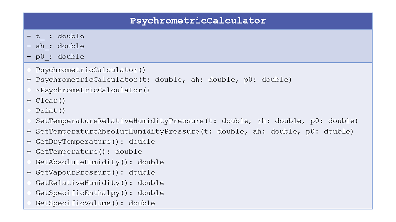

# Specifications of the class *PsychrometricCalculator*

The class to implement is called *StatisticsCalculator* and must be able to compute a number
of common statistical values including standard deviation, mean, mediane, and more.

## Step 2.1: first implementation

**Files to write:**
  - source file: *PsychrometricCalculator.cpp*
  - header file: *PsychrometricCalculator.h*

**Specifications:**
  - You must write an empty class *PsychrometricCalculator*. 
  
  - Then you must add the private data member. By conventions, data member have a name in lower case finishing by an underscore charater *_*.
    - the dry temperature *t_* in [Kelvin]. Default value is: 293 K.
	- the absolute humidity *ah_* in [kg water / kg dry air]. Default value is: 5e-3 kg water / kg dry air.
	- the pressure of the humid air *p0_* in [Pa]. Default value: 100000 Pa.
	
	
  - You must add two constructors:
    - one constructor with no argument where data members will be initialized to the default values.
    - one constructor with a second constructor with the dry tempterature, the absolute humidity and the pressure in argument.
	
  - You must add one destructor.
	
  - Finally the class must contain a function *Print* for displaying their valeurs at the screen.
  
**Instructions:**
  - Implementing the code corresponding to the specifications inside the files *PsychrometricCalculator.cpp* and *PsychrometricCalculator.h*.
  - Creating a main file called *main.cpp* for using and testing the class implementation.
  - Building and testing the program to check the class implementation.
  
## Step 2.2: adding accessors and mutators

**Specifications:**
  - You must add to the class some mutators in order to change the values of the data members:
    - *SetTemperatureAbsoluteHumidityPressure* for setting together all the data members. The units of the inputs are K for temperature, kg
water / kg dry air for absolute humidity and bar for pressure.
	 
  - You must add to the class some accessors in order to access the valuers of the data members:
    - *GetTemperature* (or equivalently *GetDryTemperature*) which returns the temperature in Kelvin.
	- *GetAbsoluteHumidity* which returns the absolute humidity in kg water / kg dry air.
	- *GetPressure* which returns the pressure in bar.
  
  - Finally the class must contain a function *Clear* for respectively reseting the data member (set to default value).
   
**Instructions:**
  - Implementing the code and updating the file *main.cpp* for using and testing the class implementation.
  - Building and testing the program to check the class implementation.

## Step 2.3: algorithmic part

**Specifications:** 
  - The class must contain several specific functions for computing the properties of the humid air:
    - *GetVapourPressure*: computing and returning the water vapour pressure [ in Pa ]
according to Equation 1.
    - *GetRelativeHumidity*: computing and returning the relative humidity [ in % ]
according to Equation 2.
    - *GetSpecificVolume*: computing and returning the air specific volume [ in m3 / kg dry air ] according to Equation 4.

  - The class must contain the mutator SetTemperatureRelativeHumidityPressure for setting the data members. The units of the inputs are K for temperature, % for relative humidity and Pa for pressure.

All the thermics formula can be found in this [PDF file](psychrometric_formulas.pdf).

**Instructions:**
  - Implementing the code and updating the file *main.cpp* for using and testing the class implementation.
  - Building and testing the program to check the class implementation.
 
## Step 2.4: enriching the structure of the class

**Specifications:** 
  - Add a copy constructor.
  - Associate the reserved word *const* to the appropriated functions.
  - Overloading the operator << to display all the data member values and computed values when *std::cout* is applied directly to instance of this
class.
  - Overloading the operator [] to get the dry temperature for [0], the specific enthalpy for [1] and the specific volume
for [2].

**Instructions:**
  - Implementing the code and updating the file *main.cpp* for using and testing the class implementation.
  - Building and testing the program to check the class implementation.
  
  
## Summary: the UML diagram 

   
