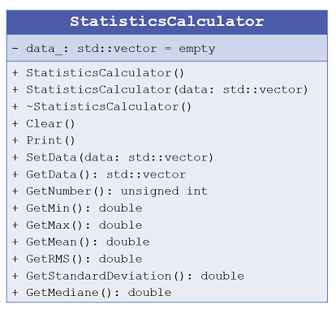

# Specifications of the class *StatisticsCalculator*

The class to implement is called *StatisticsCalculator* and must be able to compute a number
of common statistical values including standard deviation, mean, mediane, and more.

## Step 2.1: first implementation

**Files to write:**
  - source file: *StatisticsCalculator.cpp*
  - header file: *StatisticsCalculator.h*

**Specifications:**
  - You must write an empty class *StatisticsCalculator*. 
  
  - Then you must add the private data member. By conventions, data member have a name in lower case finishing by an underscore charater *_*.
    - The class must contain the data to analyze. For that, the data must be contained in an
vector of double values called *data_*. It is advised that you should use the *vector* class of the STL library. Default value: the data array is empty.
	
  - You must add two constructors:
    - one constructor with no argument where data members will be initialized to the default values.
    - one constructor with a second constructor with a vector of double values in argument.
	
  - You must add one destructor.
	
  - Finally the class must contain a function *Print* for displaying their valeurs at the screen.
  
**Instructions:**
  - Implementing the code corresponding to the specifications inside the files *StatisticsCalculator.cpp* and *StatisticsCalculator.h*.
  - Creating a main file called *main.cpp* for using and testing the class implementation.
  - Building and testing the program to check the class implementation.
  
## Step 2.2: adding accessors and mutators

**Specifications:**
  - You must add to the class some mutators in order to change the values of the data members:
     - the function *SetData* for filling the data member called *data_*.
	 
  - You must add to the class some accessors in order to access the valuers of the data members:
     - the function *GetData* for getting the data member called *data_*.
	 - the function *GetNumber* for getting the size of the data member called *data_*.   
  
  - Finally the class must contain a function *Clear* for respectively reseting the data member (set to default value).
   
**Instructions:**
  - Implementing the code and updating the file *main.cpp* for using and testing the class implementation.
  - Building and testing the program to check the class implementation.

## Step 2.3: algorithmic part

**Specifications:** The class must contain several specific functions for computing statistical information:
  - *GetMax*: searching and returning the maximum value of the data collection.
  - *GetMin*: searching and returning the maximum value of the data collection.
  - *GetMean*: computing and returning the average value of data.
  - *GetRMS*: computing and returning the Root Mean Square value of data.
  - *GetStandardDeviation*: computing and returning the standard deviation.
  - *GetMediane*: searching and returning the mediane value of data.

**Instructions:**
  - Implementing the code and updating the file *main.cpp* for using and testing the class implementation.
  - Building and testing the program to check the class implementation.
  - Does your code work when *data_* is empty? Please check this case and fix your code if it does not tolerate a such case.
 
## Step 2.4: enriching the structure of the class

**Specifications:** 
  - Add a copy constructor.
  - Associate the reserved word *const* to the appropriated functions.
  - Overloading the operator << to display all the data member values and computed values  when *std::cout* is applied directly to instance of this
class.
  - Overloading the operator [] to get the values of the array inside the class.

**Instructions:**
  - Implementing the code and updating the file *main.cpp* for using and testing the class implementation.
  - Building and testing the program to check the class implementation.
  
  
## Summary: the UML diagram 

   
